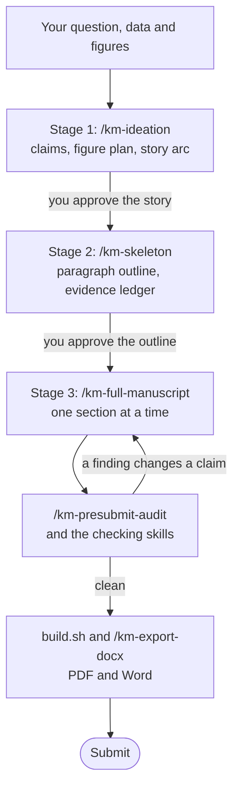
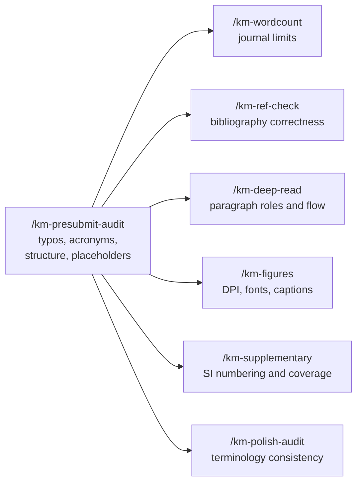
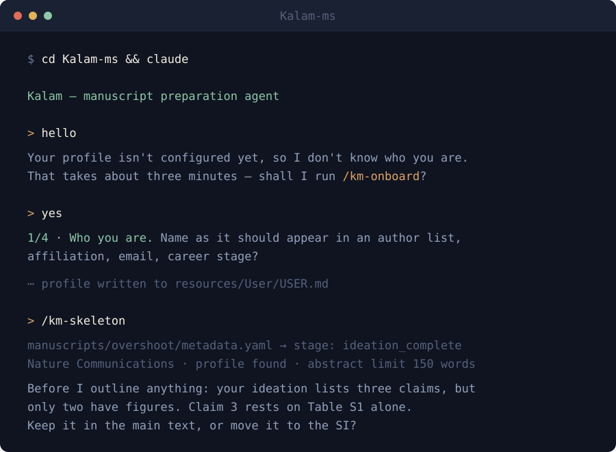

<p align="center">
  
</p>

**A manuscript-preparation agent for scientific papers.** Kalam turns a coding agent
into a writing collaborator that knows how scientific papers are actually built: from
the question and the figures, through a skeleton, to a submitted draft — with the
journal's limits, your citation strategy, and a real pre-submission audit in the loop.

Kalam is **prompts, conventions and small scripts** — not a service, not a model, not a
wrapper around an API. There is nothing to sign up for and nothing phones home. It runs
inside the agent you already use.

## Why it exists

Asking a general-purpose agent to "write my paper" produces prose that reads like an
agent wrote it: promotional, hedged in the wrong places, and confident about things the
data cannot support. Kalam's core is a writing policy that forbids exactly those habits,
plus 28 focused skills that each own one job and delegate the rest instead of
duplicating it.

It will not invent a result, a citation, or a claim about your track record.

## How it works

Three stages, each ending at a **human approval gate**. Withhold approval and the stage
repeats; nothing moves forward until you say so. The gates are the point: drafting prose
around an unsettled story is the most expensive mistake in paper writing, and an agent
will cheerfully do it for you unless something stops it.



| Stage | You bring | Kalam produces | Gate |
|---|---|---|---|
| **1 · Ideation** | figures, data, a rough idea | the question, its one-sentence answer, the figure plan, which claim rests on which evidence | you confirm the story, usually with coauthors |
| **2 · Skeleton** | the confirmed story | a paragraph-by-paragraph outline and an explicit main-text evidence budget | you confirm the outline |
| **3 · Full manuscript** | the confirmed skeleton | drafted sections, audited, exported to PDF and Word | you submit |

Every stage is recorded in the manuscript's `metadata.yaml`, and skills refuse work that
skips one.

### The checking skills have one owner each

`/km-presubmit-audit` is an orchestrator, not a monolith. It owns typos, acronyms,
structure and placeholders, and delegates everything else to the skill that owns it — so
two skills never report the same problem in different words.



## Requirements

| | Needed for | |
|---|---|---|
| **An agent that reads local files** | everything | Claude Code, OpenAI Codex, Gemini CLI, or similar |
| **Python 3.9+** | the bundled scripts | standard library only — nothing to `pip install` |
| `pandoc` | Word export, Markdown→PDF builds | optional |
| `xelatex` (TeX Live / MacTeX) | PDF builds | optional |
| `matplotlib`, `numpy` | regenerating the demo figures | optional |
| `python-docx`, `python-pptx` | `/km-export-docx`, `/km-slides` | optional |
| `edge-tts` | `/km-audio` spoken drafts | optional |

Drafting, reviewing and auditing work with Python alone. The optional tools only affect
what you can *export*.

## Install

```bash
git clone https://github.com/sudshu/Kalam-ms.git
cd Kalam-ms
python tests/framework/test_skill_registry.py   # optional: confirm the install is intact
```

The repository is `Kalam-ms` (*ms* for manuscript); the tool itself is just **Kalam**.

That is the whole installation. Now open the directory with your agent:

```bash
claude          # Claude Code  — reads CLAUDE.md
codex           # OpenAI Codex — reads AGENTS.md
gemini          # Gemini CLI   — reads GEMINI.md
```

All three files are the same brief; `CLAUDE.md` and `GEMINI.md` are symlinks to
`AGENTS.md`.

## How you use it

Kalam is **not a program you run**. It is a brief your agent reads. You open this folder
with your agent, talk to it in plain language, and it works inside the manuscript folder
according to Kalam's conventions.

Three files decide what happens on any given turn:

| File | Decides |
|---|---|
| `resources/User/USER.md` | who you are — author block, writing preferences, standing acknowledgements |
| `manuscripts/<name>/metadata.yaml` | which manuscript, what stage it is in, which journal's rules apply |
| the skill you ask for | what gets done — and what it refuses to do |

### Your first session

Say **hello**. Kalam will notice that `resources/User/USER.md` is unconfigured and offer
to onboard you. Say yes, or ask for it directly with `/km-onboard`.

<p align="center">
  
</p>

The interview takes about three minutes — name and affiliation as they should appear in
an author list, your field, the journals you target, how you like your prose, and any
standing funding sentence your institution requires. It then writes your own
`resources/User/USER.md`, checks which export tools you have installed, and tells you
what each one unlocks. Skip it if you prefer; Kalam will just ask the same things later,
one at a time.

Note what happens at `/km-skeleton` above: it does **not** start writing. It reads the
manuscript's stage and journal, notices a claim with no figure behind it, and asks. That
exchange is the whole idea.

### A normal working session

| Step | Ask for | Why |
|---|---|---|
| 1 | `/km-orient` | Reads the active manuscript's stage, log and latest build, summarises in a few lines, then **stops**. Costs nothing and saves the agent re-deriving context. |
| 2 | the stage skill you need | `/km-ideation`, `/km-skeleton` or `/km-full-manuscript`, depending on where `metadata.yaml` says you are. |
| 3 | a checking skill | `/km-deep-read` while drafting; `/km-presubmit-audit` when you think you are done. |
| 4 | `/km-bump-version`, then `build.sh` | Versions the draft and sweeps stale exports, so `output/` does not fill with near-identical PDFs. |

Decisions belong in the manuscript's `notes.md`; actions get logged to its `logfile.md`.
Six weeks later you will want to know why you cut that figure.

### Three ways in

- **New to Kalam** → [`QUICKSTART.md`](QUICKSTART.md) walks you through the bundled demo
  manuscript in about twenty minutes. Start here.
- **A paper in mind** → `/km-new-manuscript`, then `/km-ideation`.
- **A draft you already have** → `/km-new-manuscript`, paste your text into `drafts/`,
  update `current_draft` in `metadata.yaml`, then `/km-deep-read` for a first assessment.

### What it will not do

Knowing the refusals is most of knowing how to use it:

- **Draft the whole paper in one pass.** One section at a time, with you in the loop.
- **Skip a stage.** `metadata.yaml` records where you are and skills honour it.
- **Invent a citation, a number, or a claim about your track record.** Missing
  information comes back as `[VERIFY: ...]`, not as plausible filler.
- **Guess a journal's limits.** If there is no profile in
  `resources/journal_profiles/`, it says so instead of assuming.
- **Tell you your science is right.** It checks prose, structure and references — never
  whether a result is real.

## The skills

Ask for these by name in your agent. Each reads its own `skills/<name>/SKILL.md`.

**Getting started** · `/km-onboard` first-run interview · `/km-orient` session-start
status read · `/km-new-manuscript` scaffold a manuscript

**The three stages** · `/km-ideation` figures, claims, story · `/km-skeleton`
paragraph outline + evidence ledger · `/km-full-manuscript` drafted sections

**Writing** · `/km-abstract` · `/km-academic-polish` line-by-line rewrite ·
`/km-polish-terms` terminology harmonization · `/km-cover-letter` ·
`/km-supplementary` · `/km-response-to-reviewers`

**Checking** — non-overlapping ownership; `/km-presubmit-audit` orchestrates the rest ·
`/km-presubmit-audit` · `/km-wordcount` against journal limits · `/km-ref-check`
bibliography correctness · `/km-deep-read` paragraph-by-paragraph audit ·
`/km-polish-audit` terminology consistency · `/km-figures` · `/km-diff-review`

**Advice** · `/km-advisor` expert critique · `/km-editor-review` dual editor panel ·
`/km-research` literature work · `/km-analysis` drive an external analysis folder

**Output** · `/km-export-docx` · `/km-slides` · `/km-audio` spoken draft ·
`/km-bump-version` · `/km-tidy-exports` · `/km-wordcount`

## What is where

```
AGENTS.md                     the agent's brief — read this to understand Kalam
assets/                       README banner and session illustration (SVG)
skills/km-*/SKILL.md          28 skills, one job each
resources/
  conventions/                the rules: writing style, figures, export, metadata
  journal_profiles/           12 journals: limits, structure, submission specifics
  manuscript_template/        what /km-new-manuscript copies
  User/USER.md                you (written by /km-onboard)
manuscripts/
  demo-carbon-debt/           bundled synthetic demo — delete when done
  registry.yaml               name → path → stage index
lib/kalam_core/               path resolution, metadata parsing, validation
tests/framework/              structural checks on the framework itself
```

`resources/conventions/writing_style.md` is the single source of truth for
reader-facing prose. Every writing and editing skill inherits from it. If you change one
thing about Kalam, change that file.

## Making it yours

Kalam ships opinionated because a vague writing policy is worthless. Disagreeing with it
is expected:

| To change | Edit |
|---|---|
| How prose should read | `resources/conventions/writing_style.md` |
| Figure defaults | `resources/conventions/figures.md` |
| Your journal's limits | `resources/journal_profiles/<journal>.md` — or add one |
| What a new manuscript starts as | `resources/manuscript_template/` |
| Your own details | `resources/User/USER.md`, or re-run `/km-onboard` |

To add a journal, copy the closest existing profile and edit it from the journal's own
author guidelines. Do not let an agent guess a word limit — put the real number in the
profile.

## Limitations, honestly

- **It is a writing framework, not a scientist.** It will not check whether your science
  is right, and it cannot tell a real result from an artefact.
- **Journal profiles drift.** The 12 bundled profiles were written from author
  guidelines at a point in time. Verify limits against the journal before submitting.
- **`/km-ref-check` validates format and internal consistency**, not whether a reference
  says what you claim it says.
- **The demo's numbers are invented.** See `manuscripts/demo-carbon-debt/README.md`.
- **v0.1.** The skills are in daily use on real manuscripts, but this is the first
  public release; expect rough edges in the paths less travelled.

## Contributing

Bug reports and new journal profiles are the most useful contributions. See
[`CONTRIBUTING.md`](CONTRIBUTING.md).

## Credit and license

Kalam was created by **Sudhanshu Pandey**.

Licensed under MIT — see [`LICENSE`](LICENSE).

"Kalam" (क़लम / قلم) means *pen*.
